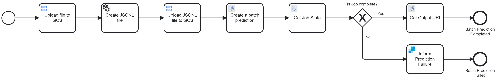

# GCP-AI Batch Prediction Blueprint

## Blueprint flow
- File Upload: An input data file provided as input is uploaded to Google Cloud Storage (GCS) and store it in a bucket using connector.

<p align="center">

</p>

- JSONL creation: Using the uploaded file details a JSONL format file is created , It is suitable for batch prediction and then stored in GCS using GCS connector upload functionality.

- Preview of JSONL file 
```json
{"content": "gs://bucketName/cat.jpg", "mimeType": "image/jpeg"}

```
<p align="center">

</p>

- Batch Prediction Request: Using the JSONL file, a prediction request is sent to a pre-deployed model in Vertex AI to initiate a batch prediction job.

<p align="center">

</p>

- Job Monitoring: The process instance checks the status and continues polling until the prediction job is complete. If the status is failed, the instance will take the failure intimate path and will end eventually.

<p align="center">

</p>

- Output Retrieval: Upon successful completion, the output URI containing the prediction results is retrieved from GCS.

## Blueprint 
<p align="center">

</p>

## Features:

- Seamless Integration: Combines Camunda BPMN with Vertex AI for a unified predictive analytics solution.

- Automated Data Conversion: Converts uploaded data files into JSONL format automatically for consistent processing.


- Pre-Deployed Model Usage: Utilizes pre-deployed AI models for reliable and accurate predictions.

- End-to-End Automation: Manages the entire workflow from job initiation to result retrieval with minimal manual intervention.

## Contact
If you have any questions, concerns, or suggestions regarding this connector, please feel free to contact us: camunda.support@acheron-tech.com